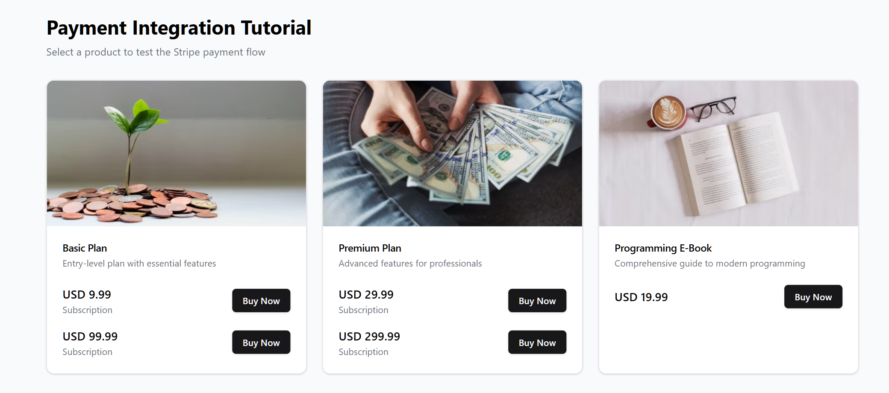

# Fullstack Payment Integration Tutorial

A step-by-step tutorial for creating a fullstack application with Stripe payment integration. This template demonstrates how to build a complete payment flow using FastAPI for the backend and React for the frontend.




## Features

- 💳 Stripe Checkout integration for secure payments
- 🔒 Backend API with FastAPI
- ⚛️ Frontend UI with React and Tailwind CSS
- 📚 Detailed inline comments explaining each step
- 🚀 Deployment instructions for both frontend and backend

## Project Structure

```
fullstack-payment-app/
├── backend/               # FastAPI backend
│   ├── app/
│   │   ├── api/           # API endpoints
│   │   │   ├── endpoints/ # API route handlers
│   │   │   └── api.py     # API router configuration
│   │   └── main.py        # FastAPI application entry point
│   ├── .env               # Backend environment variables
│   └── pyproject.toml     # Python dependencies
│
├── frontend/              # React frontend
│   ├── src/
│   │   ├── components/    # React components
│   │   ├── pages/         # Page components
│   │   └── App.tsx        # Main application component
│   ├── .env               # Frontend environment variables
│   └── package.json       # JavaScript dependencies
│
└── README.md              # Project documentation
```

## Prerequisites

- Python 3.8+
- Node.js 14+
- Stripe account (for API keys)

## Getting Started

### Step 1: Clone the repository

```bash
git clone <repository-url>
cd fullstack-payment-app
```

### Step 2: Set up the backend

1. Navigate to the backend directory:

```bash
cd backend
```

2. Install dependencies:

```bash
poetry install
```

3. Create a `.env` file with your Stripe API keys:

```
STRIPE_API_KEY=sk_test_your_stripe_secret_key
STRIPE_WEBHOOK_SECRET=whsec_your_stripe_webhook_secret
FRONTEND_URL=http://localhost:5173
```

**Important**: Replace the placeholder values with your actual Stripe API keys from [Stripe Dashboard](https://dashboard.stripe.com/apikeys). The application will use mock data when Stripe keys are not configured.

4. Start the FastAPI server:

```bash
poetry run fastapi dev app/main.py
```

The API will be available at http://localhost:8000.

### Step 3: Set up the frontend

1. Navigate to the frontend directory:

```bash
cd frontend
```

2. Install dependencies:

```bash
npm install
```

3. Create a `.env` file with your Stripe public key:

```
VITE_STRIPE_PUBLIC_KEY=pk_test_your_stripe_publishable_key
VITE_API_URL=http://localhost:8000
```

### Production Deployment

For production deployment on Render:

1. **Frontend Environment Variables**: Create `.env.production` with production URLs:
```
VITE_STRIPE_PUBLIC_KEY=pk_test_your_stripe_publishable_key_here
VITE_API_URL=https://your-backend-service.onrender.com
```

2. **Backend Environment Variables**: Create `.env.production` with production frontend URL:
```
STRIPE_API_KEY=sk_test_your_stripe_secret_key_here
STRIPE_WEBHOOK_SECRET=whsec_your_stripe_webhook_secret_here
FRONTEND_URL=https://your-frontend-service.onrender.com
```

3. **SPA Routing Configuration**: Configure rewrite rules in Render Dashboard (not via _redirects file):
   - Go to https://dashboard.render.com
   - Navigate to your frontend static site service
   - In "Redirects and Rewrites" section, add rule:
     - Source: `/*`
     - Destination: `/index.html`
     - Action: "Rewrite" (NOT "Redirect")
   - This serves React app content for all routes while preserving URLs

**Important**: Replace the placeholder value with your actual Stripe publishable key from [Stripe Dashboard](https://dashboard.stripe.com/apikeys).

4. Start the development server:

```bash
npm run dev
```

The frontend will be available at http://localhost:5173.

## Tutorial: How the Payment Flow Works

### 1. Creating Products in Stripe

Before using this application with real Stripe integration, you need to create products and prices in your Stripe dashboard:

1. Go to [Stripe Dashboard](https://dashboard.stripe.com/products)
2. Click "Add Product"
3. Fill in the product details and add a price
4. Note the Price ID (starts with `price_`) - you'll need this for testing

**Note**: The application will show mock products when Stripe API keys are not configured, allowing you to test the interface without setting up Stripe initially.

### 2. Backend API Endpoints

The backend provides three main endpoints:

- `GET /api/payment/products` - Retrieves products and prices from Stripe (or mock data if not configured)
- `POST /api/payment/create-checkout-session` - Creates a Stripe checkout session
- `POST /api/payment/webhook` - Handles Stripe webhook events

**Environment Configuration**: The backend automatically detects whether Stripe is properly configured and falls back to mock responses for development when API keys are missing.

### 3. Frontend Components

The frontend consists of three main components:

- `PaymentForm` - Displays products and initiates the checkout process
- `SuccessPage` - Displayed after successful payment
- `CancelPage` - Displayed if payment is cancelled

### 4. Payment Flow

1. User selects a product and clicks "Buy Now"
2. Frontend calls the backend to create a checkout session
3. User is redirected to Stripe's hosted checkout page
4. User enters payment details and completes payment
5. Stripe redirects back to success or cancel page
6. Stripe sends a webhook event to confirm payment

## Deployment

### Backend Deployment

To deploy the backend:

```bash
cd backend
<deploy_backend dir="$(pwd)"/>
```

### Frontend Deployment

1. Update the frontend `.env` file with the deployed backend URL:

```
VITE_API_URL=https://your-deployed-backend-url
```

2. Build and deploy the frontend:

```bash
cd frontend
npm run build
<deploy_frontend dir="dist"/>
```

## Render Deployment Configuration

### Complete Render Setup for SPA Routing

When deploying to Render, follow these steps to ensure proper SPA routing for `/success` and `/cancel` pages:

#### Frontend Service Configuration
1. **Service Type**: Static Site
2. **Repository**: Your GitHub repository
3. **Branch**: main
4. **Root Directory**: frontend
5. **Build Command**: `npm run build`
6. **Publish Directory**: `dist`
7. **Environment Variables**:
   ```
   VITE_STRIPE_PUBLIC_KEY=pk_test_your_stripe_publishable_key_here
   VITE_API_URL=https://your-backend-service.onrender.com
   ```

#### Critical SPA Routing Setup
8. **Redirects and Rewrites**: In your Render dashboard, add this rewrite rule:
   - **Source**: `/*`
   - **Destination**: `/index.html`
   - **Action**: "Rewrite" (NOT "Redirect")

This configuration ensures that:
- Direct access to `/success` loads correctly
- Direct access to `/cancel` loads correctly
- Checkout flow redirects work properly
- React Router handles client-side navigation
- Browser URLs remain unchanged (e.g., `/success`, `/cancel`)

#### Backend Service Configuration
1. **Service Type**: Web Service
2. **Repository**: Your GitHub repository
3. **Branch**: main
4. **Root Directory**: backend
5. **Build Command**: `poetry install`
6. **Start Command**: `uvicorn app.main:app --host 0.0.0.0 --port $PORT`
7. **Environment Variables**:
   ```
   STRIPE_API_KEY=sk_test_your_stripe_secret_key_here
   STRIPE_WEBHOOK_SECRET=whsec_your_stripe_webhook_secret_here
   FRONTEND_URL=https://your-frontend-service.onrender.com
   ```

#### Why This Configuration Works
- Render static sites require dashboard-based routing configuration
- The `/*` wildcard catches all routes including `/success` and `/cancel`
- Rewrite rules serve content without changing the URL
- React Router can then handle client-side navigation
- This is the official Render approach for SPA routing

#### Troubleshooting SPA Routing
If you encounter 404 errors for `/success` or `/cancel` pages:
1. Verify the rewrite rule is configured as "Rewrite" not "Redirect"
2. Ensure the rule appears as: `/* → /index.html (Rewrite)`
3. Check that the rule is saved and deployment is complete
4. Test direct access to both routes after configuration

## Extending the Template

### Adding Subscription Support

To add subscription support:

1. Modify the backend to create subscription-based checkout sessions
2. Update the product data structure to include recurring prices
3. Implement subscription management endpoints

### Adding Marketplace Support

For marketplace functionality:

1. Implement Stripe Connect for onboarding sellers
2. Add commission splitting logic
3. Create seller dashboards and payment reports

## Security Considerations

- API keys are stored in environment variables (never commit them to version control)
- Payment information is handled directly by Stripe (never touches your server)
- Webhooks are verified using signatures to prevent tampering

## Resources

- [Stripe Documentation](https://stripe.com/docs)
- [FastAPI Documentation](https://fastapi.tiangolo.com/)
- [React Documentation](https://reactjs.org/)
